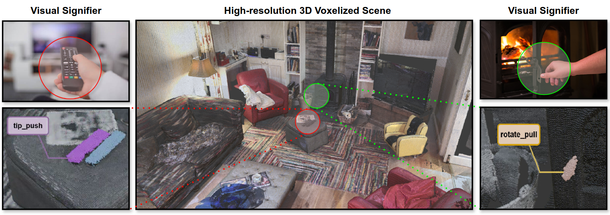
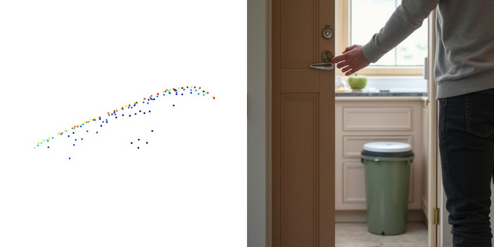

# AffordMatcher: Affordance Learning in 3D Scenes from Visual Signifiers (CVPR 2026)

### [Nghia Vu](https://scholar.google.com/citations?user=03A3aI8AAAAJ&hl=vi), [Tuong Do](https://scholar.google.com/citations?user=qCcSKkMAAAAJ&hl=en), [Khang Nguyen](https://scholar.google.com/citations?user=Z6_5ZTEAAAAJ&hl=en), [Baoru Huang](https://baoru.netlify.app/), [Nhat Le](https://minhnhatvt.github.io/), [Binh X. Nguyen](https://scholar.google.com/citations?user=KU9vgMcAAAAJ&hl=en), [Erman Tjiputra](https://sg.linkedin.com/in/erman-tjiputra), [Quang D. Tran](https://scholar.google.com/citations?user=DbAThEgAAAAJ&hl=en), [Ravi Prakash](https://scholar.google.com/citations?user=mV2CW4QAAAAJ&hl=en), [Te-Chuan Chiu](https://theochiu.wixsite.com/nthucs), [Anh Nguyen](https://cgi.csc.liv.ac.uk/~anguyen/)


### [[Project Page](https://aioz-ai.github.io/AffordMatcher/)] [[Paper](https://arxiv.org/pdf/2603.27970)]


## Abstract
> Affordance learning is a complex challenge in many applications, where existing approaches primarily focus on the geometric structures, visual knowledge, and affordance labels of objects to determine interactable regions. However, extending this learning capability to a scene is significantly more complicated, as incorporating object- and scene-level semantics is not straightforward. In this work, we introduce *AffordBridge*, a large-scale dataset with $291,637$ functional interaction annotations across $685$ high-resolution indoor scenes in the form of point clouds. Our affordance annotations are complemented by RGB images that are linked to the same instances within the scenes. Building upon our dataset, we propose **AffordMatcher** an affordance learning method that establishes coherent semantic correspondences between image-based and point cloud-based instances for keypoint matching, enabling a more precise identification of affordance regions based on cues, so-called visual signifiers.

*<center> Overview of AffordMatcher </center>*


## AffordBridge Dataset


**3D Affordance label**: We reuse the scene and 3D affordance label of SceneFun3D Dataset. Please navigate to the [SceneFun3D homepage](https://scenefun3d.github.io/) to download it 

**Visual clue images**: We reason the affordance labels in scene by annotating visual cue images, which can be downloaded [here](https://huggingface.co/datasets/aiozai/AffordBridge). 

After downloading, you will obtain the data in the following structure 

```
finalized_data
└───420693                  # scene_id
│    └───hook_pull_0        # action in format <action>_<idx>
│    │   │   image_0.png    # list of images
│    │   │   image_1.png
│    │   │   ...
│    │
│    └───hook_pull_1
│    │   │   image_2.png
│    │   │   image_3.png
│    │   │   image_4.png
│    │   │   ...
│    └───rotate_0
│    │   │   image_5.png
│    │   │   image_6.png
│    │   │   image_7.png
│    │   │   ...
│    └───...
└───421093 
│    └───...
└───...
```

## Data Visualization 

We visualize the point cloud affordance and visual cue image in our dataset. 
Modify the scene ID, affordance label and data directory for other visualizations 
```python
import open3d as o3d
import numpy as np
import cv2
import random
import os 
import json

scene_id = '420673'  #modify this 
base_point_cloud_dir = './data' #modify this 
point_cloud_annotation_dir = os.path.join(base_point_cloud_dir, scene_id, f"{scene_id}_annotations.json")
point_cloud_dir = os.path.join(base_point_cloud_dir, scene_id, f"{scene_id}_laser_scan.ply")

image_base_dir = './train' #modify this 
image_scene_dir = os.path.join(image_base_dir, scene_id)
action_list = os.listdir(image_scene_dir)

label = 'hook_turn' #modify this 
action_label = [i for i in action_list if label in i]
action_folder = random.choice(action_label)
action_dir = os.path.join(image_scene_dir, action_folder)
image_list = os.listdir(action_dir)
image_dir = os.path.join(action_dir, random.choice(image_list))


pcd = o3d.io.read_point_cloud(point_cloud_dir)

annotation = json.load(open(point_cloud_annotation_dir))
for annotation_data in annotation['annotations']: 
    if annotation_data['label'] == label: 
        affordance_idx  = annotation_data['indices']


        # color affordance red
        colors[affordance_idx] = [1, 0, 0]
        pcd = pcd.select_by_index(affordance_idx)
        pcd.colors = o3d.utility.Vector3dVector(colors)

        # render scene
        vis = o3d.visualization.Visualizer()
        vis.create_window(width=800, height=800, visible=False)
        vis.add_geometry(pcd)
        vis.poll_events()
        vis.update_renderer()

        scene_img = np.asarray(vis.capture_screen_float_buffer())
        scene_img = (scene_img * 255).astype(np.uint8)
        scene_img = cv2.cvtColor(scene_img, cv2.COLOR_RGB2BGR)

        vis.destroy_window()

        # load demonstration image
        demo_img = cv2.imread(image_dir)

        # resize to same height
        h = min(scene_img.shape[0], demo_img.shape[0])

        scene_img = cv2.resize(
            scene_img,
            (int(scene_img.shape[1] * h / scene_img.shape[0]), h)
        )

        demo_img = cv2.resize(
            demo_img,
            (int(demo_img.shape[1] * h / demo_img.shape[0]), h)
        )

        # concatenate
        combined = np.hstack([scene_img, demo_img])

        cv2.imshow("Visualization", combined)
        cv2.waitKey(0)
        exit()
```


## Progress
- **AffordBridge Dataset release**: ✅
- **Detailed reasoning descriptions**: TBD


## Citation
If you find this work interesting and helpful, please consider citing
```
@inproceedings{vu2026AffordMatcher,
	title        = {AffordMatcher: Affordance Learning in 3D Scenes from Visual Signifiers},
	author       = {Vu, Nghia and Do, Tuong and Nguyen, Khang and Huang , Baoru and Le, Nhat and Nguyen, Binh X and Tjiputra, Erman and Tran, Quang D and Prakash, Ravi and Chiu, Te-Chuan and Nguyen, Anh},
	year         = {2026},
	booktitle    = {CVPR},
}
```
## License
MIT License
